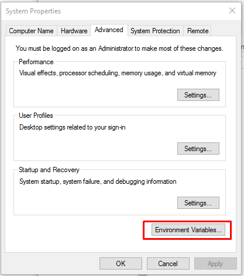
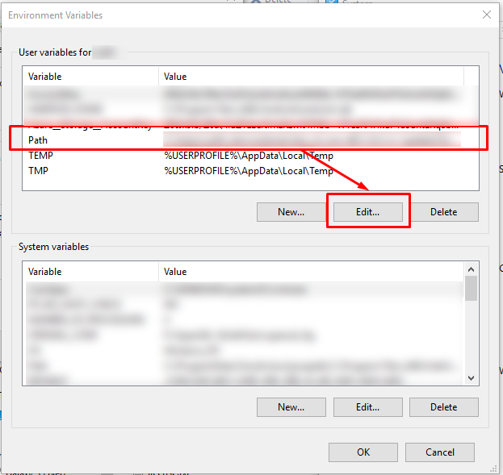
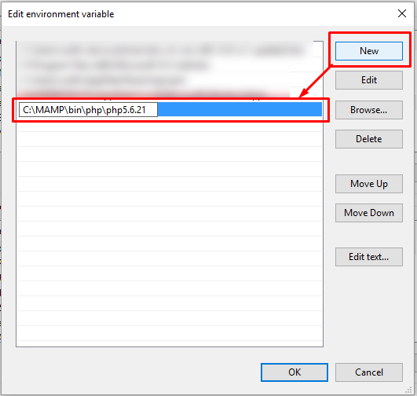

# How to set up the project

mac users can skip steps 1-8

1.  [download php](https://windows.php.net/downloads/releases/php-7.2.8-Win32-VC15-x64.zip) 
2.  extract it to `C:\php`
3.  go to the windows search bar and search for "environment variables" and click on the result from control panel
4. click the "environment variables" button in the bottom right of the window that appears

5. Select the `Path` line, and click `Edit`

6. Click `New...`, type `C:\php` into the box and press `ENTER `

7. [Download] and install git Bash (if you dont already have it, try searching for "Git Bash")
8. Go to where you cloned the repository, right click inside the folder and select `Git Bash Here` (or open a terminal window and `cd` into the directory on a mac)
9. go to [the composer download page](https://getcomposer.org/download/) and copy the clock of text under *Command Line Install*
10. paste it into your git bash window
11. wait for it to finish and hit enter to run the final command.
12. type `php composer.phar install` to install the dependencies
13. close the git bash window when this finishes.
14. go to visual studio code. Search for and install the extension "PHP Server". Reload VSCode when done
15. open the project folder in visual studio code and click on the `index.php` file.
16. in the top richt corner, click the blue button to start the server (or use the right click menu)
17. simply refresh this page to see your changes. you can paste the URL into another browser too.

[image credits](http://www.forevolve.com/en/articles/2016/10/27/how-to-add-your-php-runtime-directory-to-your-windows-10-path-environment-variable/) 